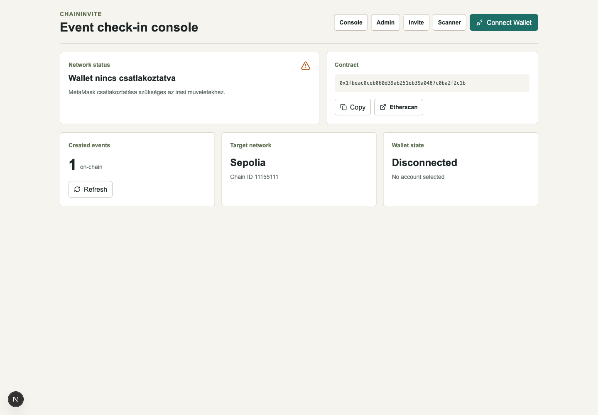
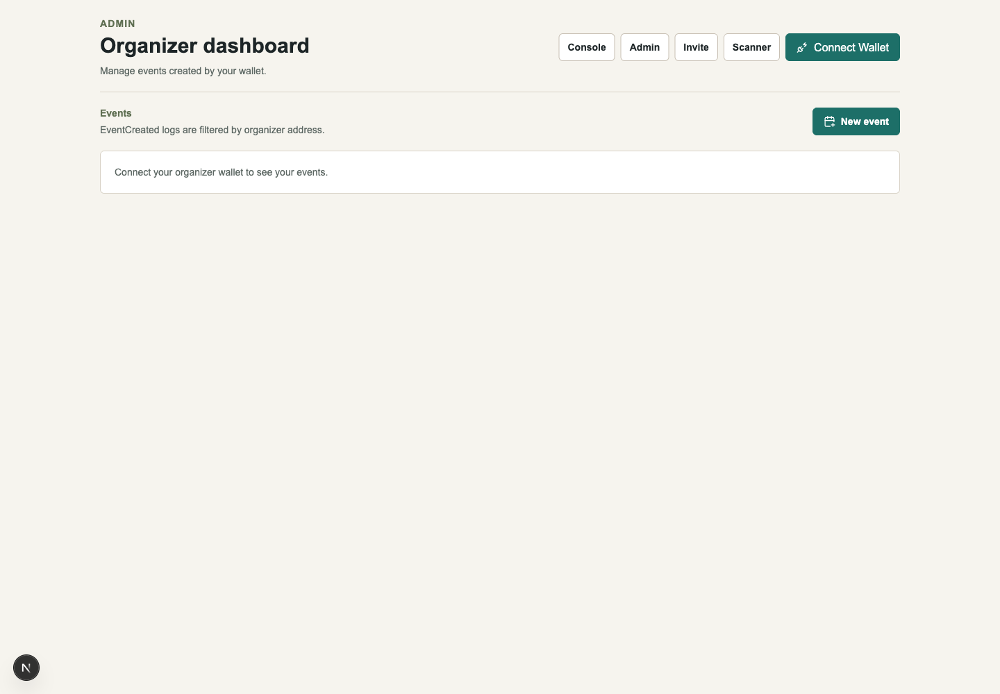
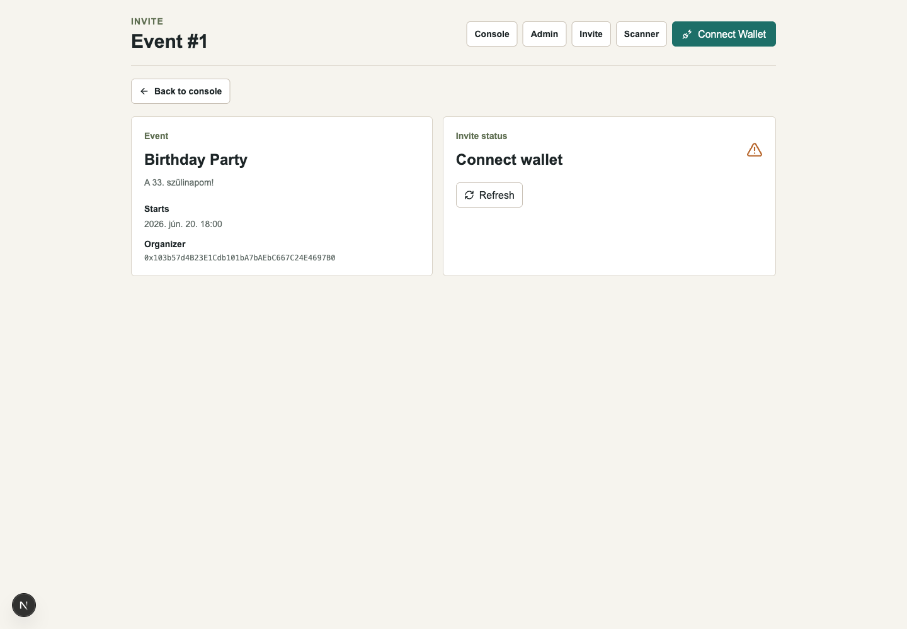
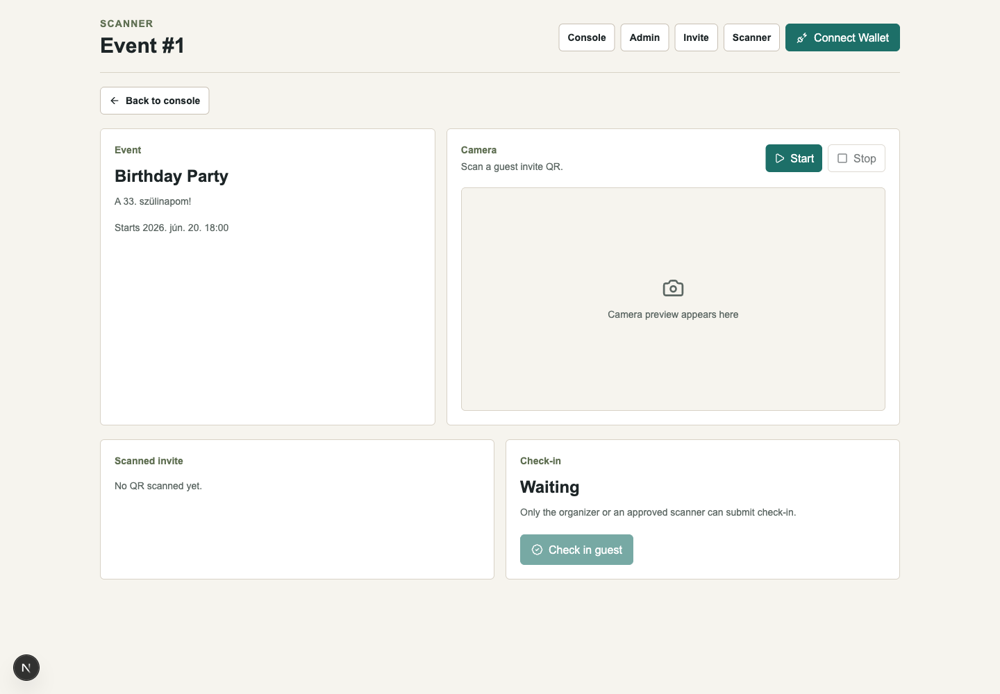
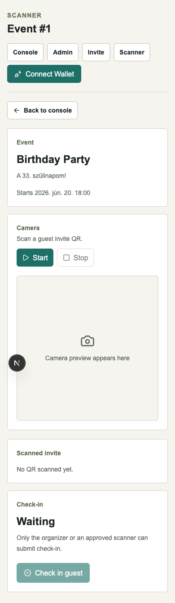

# ChainInvite

Blockchain-alapu esemenymeghivo es QR check-in dApp.

ChainInvite egy Sepolia testneten futo MVP, ahol egy organizer wallet esemenyt hoz letre, vendeg wallet cimeket hiv meg, a vendeg QR-kodot kap, a helyszini scanner pedig on-chain check-int indit. A meghivo egyszer hasznalatos: check-in utan ugyanaz a QR mar ervenytelen.

## Stack

- Solidity 0.8.x
- Hardhat 3
- Next.js + TypeScript
- Tailwind CSS
- wagmi + viem
- Sepolia testnet
- MetaMask

## Funkciok

- Smart contract esemennyel, meghivottakkal, scanner jogosultsaggal es check-in allapottal
- Organizer admin felulet:
  - esemeny letrehozasa
  - sajat esemenyek listazasa `EventCreated` logokbol
  - vendeg meghivasa
  - scanner engedelyezese vagy tiltasa
  - check-in statusz megjelenitese
- Vendeg meghivo oldal:
  - wallet connect
  - meghivo ervenyesseg ellenorzese
  - QR-kod generalas
- Scanner oldal:
  - kamera alapú QR olvasas localhoston vagy HTTPS-en
  - QR JSON validalas
  - `isValidInvite` ellenorzes check-in elott
  - `checkIn` tranzakcio
- Rossz halozat kezeles Sepolia switch gombbal
- Tranzakcio pending / success / error allapotok

## Deployolt Contract

- Network: Sepolia
- Chain ID: `11155111`
- Address: `0x1fbeac0ceb060d39ab251eb39a0487c0ba2f2c1b`
- Deployment block: `11097427`
- Etherscan: https://sepolia.etherscan.io/address/0x1fbeac0ceb060d39ab251eb39a0487c0ba2f2c1b

## Demoadatok

- Event ID: `1`
- Event name: `Birthday Party`
- Organizer: `0x103b57d4B23E1Cdb101bA7bAEbC667C24E4697B0`
- Guest: `0x719C7E4f50Eb8a66E01AeB140909c9c8350eDaf7`

## Kepernyokepek

### Dashboard



### Admin



### Invite



### Scanner



### Scanner Mobile



## Telepites

Gyoker dependencyk:

```bash
npm install
```

Frontend dependencyk:

```bash
cd web
npm install
```

## Env Valtozok

Gyoker `.env`:

```env
SEPOLIA_RPC_URL=https://sepolia.infura.io/v3/YOUR_INFURA_PROJECT_ID
PRIVATE_KEY=0xYOUR_TEST_WALLET_PRIVATE_KEY
```

Frontend `web/.env.local`:

```env
NEXT_PUBLIC_CHAININVITE_ADDRESS=0x1fbeac0ceb060d39ab251eb39a0487c0ba2f2c1b
NEXT_PUBLIC_CHAIN_ID=11155111
NEXT_PUBLIC_CHAININVITE_DEPLOYMENT_BLOCK=11097427
```

Ne commitolj privát kulcsot. A `PRIVATE_KEY` csak tesztwallet legyen.

## Contract Parancsok

Forditas:

```bash
npm run compile
```

Teszt:

```bash
npm test
```

Deploy Sepoliara:

```bash
npm run deploy:sepolia
```

## Frontend Parancsok

```bash
cd web
npm run dev
npm run build
npm run lint
```

Fejlesztoi URL:

```text
http://localhost:3000
```

## Demo Flow

1. Nyisd meg a frontendet: `http://localhost:3000`.
2. Csatlakoztasd a MetaMask walletet.
3. Ha a wallet nem Sepolián van, kattints a `Switch to Sepolia` gombra.
4. Organizer flow:
   - `/admin`
   - `/admin/events/new`
   - hozz letre esemenyt
   - nyisd meg az esemeny reszleteit
   - hivj meg egy guest wallet cimet
   - opcionálisan engedelyezz scanner walletet
5. Guest flow:
   - `/invite/1`
   - csatlakozz a meghivott guest wallettel
   - ha ervenyes a meghivo, megjelenik a QR
6. Scanner flow:
   - `/scanner/1`
   - csatlakozz organizer vagy engedelyezett scanner wallettel
   - inditsd a kamerat
   - olvasd be a guest QR-t
   - kattints a `Check in guest` gombra
7. Ellenorzes:
   - ugyanaz a QR check-in utan mar invalid/already used allapotba kerul
   - az admin esemenyoldalon a vendeg statusza `Checked in`

## Fontos Megjegyzesek

- A kamera bongeszoben HTTPS-t vagy localhostot igenyel.
- A contract mappingek nem listazhatok, ezert az admin lista `EventCreated`, `GuestInvited` es `ScannerUpdated` logokbol epul.
- A log olvasas a deployment blocktol indul, hogy RPC range limitekbe ne fusson bele.
- A QR payload szandekosan egyszeru JSON:

```json
{ "eventId": "1", "guest": "0x..." }
```
